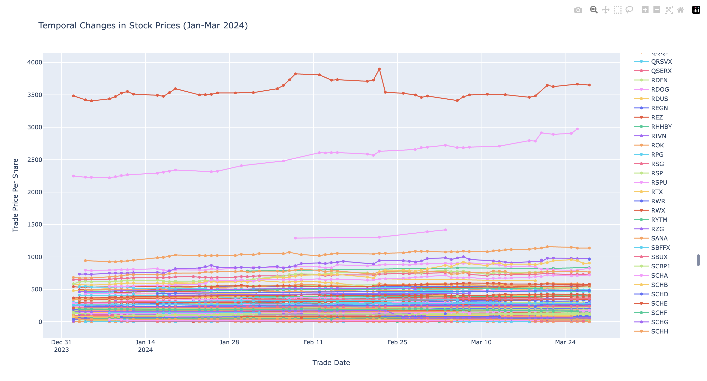
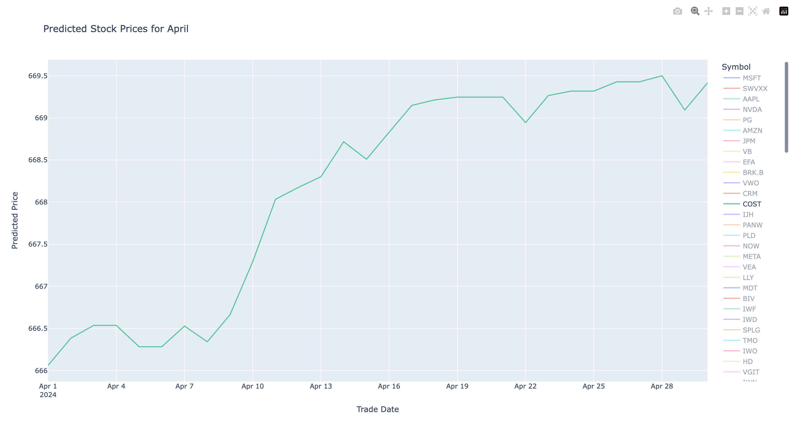

# Stock Price Prediction Using Machine Learning

## Bridging Finance and Data Science: A Personal Journey
Coming from a data science background with extensive experience in data wrangling and implementing machine learning models, my summer internship at Badgley Phelps, a wealth management firm, presented an exciting opportunity to bridge data science with finance. As someone passionate about the transformative potential of data-driven decision-making, I was eager to explore how machine learning could enhance traditional finance workflows and ultiamtely provide greater value to clients. The firm had specialized teams across Research, Operations, Financial Planning, and Trading, each playing a crucial role in client service. While my primary focus was on income projections, estate planning, and client relationships, I identified an opportunity to apply technical expertise in a field traditionally driven by fundamental analysis.

During my time at Badgley Phelps, I observed that the firm's data analysis was primarily performed using Excel, a powerful tool but one that lacked the sophistication of advanced data science techniques. Recognizing this gap, I proposed a project to leverage machine learning for stock price prediction. Recognizing the profound impact it could have on the firm's investment strategies through creating a system for identifying high-return stocks, this is a project that ultimately bridged finance and data science.

## Uncovering the Potential for Data Science in Finance
Leveraging machine learning to predict stock prices, this project uses a Random Forest model with engineered features to improve predictive accuracy, outperforming traditional methods. While the data used for analysis is proprietary and confidential to Badgley Phelps and cannot be attached to this project, the approach demonstrates how historical trading data can be effectively transformed into actionable insights for portfolio management. The project further explores the effectiveness of advanced visualization and feature engineering in capturing complex market patterns.

## Bridging the Gap: Applying Machine Learning to Portfolio Management
The purpose of this project was to introduce data science applications to Badgley Phelps, showcasing how machine learning can optimize manual research typically conducted via Bloomberg, Yahoo Finance, Morningstar, JPMorgan, and other financial data sources. This was an ideal opportunity to combine data science and business for impactful results. By optimizing the research process through combining historical trading data with advanced analytics, I aimed to create a system for identifying high-return stocks, a process that would not only enhance portfolio management but also free up time for the firm's professionals to focus on more meangingful client interactions.

## Revolutionizing Workflows: The Potential of Data Science Across Industries
As data science becomes more ubiquitous across industries, I believe it will revolutionize workflows, ultimately allowing professionals to dedicate more time to serving people and improving their lives. By automating research-intensive tasks and providing data-driven insights, we can empower financial advisors to have deeper, more impactful conversations with their clients, fostering trust and better supporting their financial needs.

## The Project: Leveraging Machine Learning for Stock Price Prediction
The primary objective was to develop a machine learning model capable of predicting stock prices for the upcoming month using historical trading data. I compared a Random Forest model against baseline approaches, including Linear Regression and a naive method that used the previous day's price, to demonstrate the power of advanced techniques in capturing complex market patterns.

## Enhancing Portfolio Optimization: The Role of Research and Data Science
Research provides the fundamental basis for the why and how of investment allocation protocols. By incorporating data science and machine learning into the research process, we can unlock new opportunities for portfolio optimization, empowering financial professionals to make more informed decisions and ultimately deliver better outcomes for their clients.

## Technical Approach and Key Findings
### Script Overview
- **ML_Explore.py**: Initial exploratory data analysis script focused on data preprocessing and visualization. Handles the cleaning of raw trading data, implements temporal feature creation, and generates interactive visualizations to understand price patterns across different symbols. Outputs processed data for subsequent modeling.
- **ML.py**: Core implementation of the Random Forest model for stock price prediction. Focuses on feature engineering, model training pipeline development, and initial hyperparameter tuning. Creates lag features, rolling means, and calendar-based features while implementing parallel processing for efficient multi-symbol handling.
- **ML_Optimize.py**: Advanced model optimization script that introduces baseline comparisons against Linear Regression and naive prediction approaches. Demonstrates the Random Forest model's superior performance (98% R² score) compared to simpler methods. Implements extensive hyperparameter tuning and generates comprehensive performance metrics for model evaluation.

### Visualization Overview
- **temporal_changes_symbols_plot.html**:
Temporal representation of stock price changes from January 2024 - March 2024
[]
[View Stock Price Changes](/temporal_changes_symbols_plot.html)

- **Model_Projection_Visualization.html**:
Random Forest prediction of Stock price changes
[]
[View Stock Price Predictions](/Model_Projection_Visualization.html)

## Dataset
- **Time Period**: January to March 2024
- **Key Features**: Stock symbols, trade dates, and trade prices

### Data Preprocessing
- Removal of dollar signs
- Conversion of prices to numeric values
- Date formatting standardization

## Methodology

### 1. Data Preprocessing
- **Loading Data**: Implemented robust data loading from CSV files with over 45,000 observations.
- **Cleaning Operations**:
  - Removed currency symbols
  - Converted price strings to numeric values
  - Standardized date formats
- **Data Filtering**: Applied date range filtering (Jan 2, 2024 - Mar 28, 2024)

### 2. Feature Engineering
- **Temporal Features**:
  - Created 1-day and 2-day lag features
  - Implemented rolling mean calculations
- **Date-Based Features**:
  - Extracted day, month, and day of the week
  - Created cyclical features for capturing temporal patterns

Using temporal features allowed for a better understanding of stock price trends and improved model accuracy. This enhancement reduced errors significantly (lower MSE and MAE) compared to earlier versions, highlighting the importance of time-based patterns in stock price prediction.

### 3. Model Development
- **Random Forest Implementation**:
  - Hyperparameter tuning via GridSearchCV
  - Selected optimal tree depth and number of estimators
- **Baseline Models**:
  - Linear Regression
  - Naive prediction using previous day's price
- **Evaluation Metrics**:
  - Mean Squared Error (MSE)
  - Mean Absolute Error (MAE)
  - R² Score

### 4. Visualization Pipeline
- **Interactive Visualizations**: Implemented using Plotly.
- **Temporal Analysis**: Created dynamic visualizations of price changes over time.
- **Prediction Visualization**: Generated forecast visualizations for April.

## Results & Analysis
The Random Forest model demonstrated superior performance compared to baseline models:
- **Random Forest Performance**: 98% R² score.
- **Comparison to Baselines**:
  - 76% reduction in MSE compared to Linear Regression.
  - 90% reduction in MSE compared to Naive Predictor.
- **Additional Benefits**:
  - Improved handling of market volatility.
  - Enhanced insights into feature importance.

## Key Learnings
- **Feature Engineering Impact**: Lag features and rolling means significantly boosted model performance.
- **Hyperparameter Optimization**: GridSearchCV was crucial for fine-tuning.
- **Model Comparison**: The ensemble approach of Random Forest outperformed simpler models.

## Technical Challenges & Solutions
- **Data Quality**: Implemented robust pipelines to handle missing values and outliers.
- **Model Optimization**: Used cross-validation and hyperparameter tuning to prevent overfitting.
- **Scalability**: Optimized code to efficiently handle multiple stock symbols.

## Future Enhancements
- **Advanced Models**: Integrate LSTM networks for improved temporal modeling. LSTM’s sequential nature could capture time-dependent patterns more effectively, potentially leading to more accurate stock price predictions.
- **Sentiment Analysis**: Including sentiment analysis on financial news could add valuable context to the feature engineering process, enhancing model accuracy by accounting for market sentiment.
- **Data Expansion**: Incorporate larger historical datasets to further improve model accuracy
- **Feature Enhancement**: Exploring additional technical indicators and market sentiment metrics.

As data science continues to permeate across industies, this project serves as a benchmark for the transformative potential of bridging finance and data science. By optimizing research workflows and enhancing portfolio management, we can empower financial professionals to focus on their core mission of serving clients and improving their financial well-being.

## Conclusion
This project demonstrates the power of applying machine learning to stock price prediction, offering a compelling case for the integration of data science in the finance industry. The comprehensive approach to feature engineering and model evaluation provides a strong foundation for further development in algorithmic trading strategies. By bridging the gap between finance and data science, this project offers a novel perspective on portfolio optimization that the firm can potentially adopt in the future.

By showcasing the potential of advanced analytics to outperform traditional methods, this work paves the way for a future where data-driven insights and automated workflows revolutionize the way financial professionals operate, ultimately leading to better outcomes for their clients and the broader community.

## Technologies Used
- **Python Libraries**: `pandas`, `numpy`, `scikit-learn`, `plotly`
- **Machine Learning**: `RandomForestRegressor`, `LinearRegression`
- **Data Visualization**: `Plotly`, `Seaborn`
- **Data Processing**: `pandas`, `numpy`
